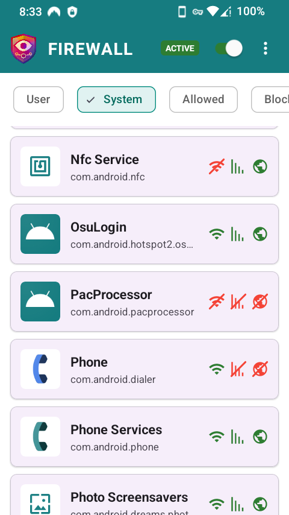
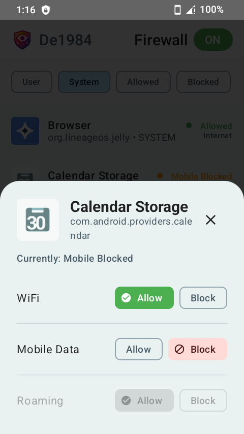
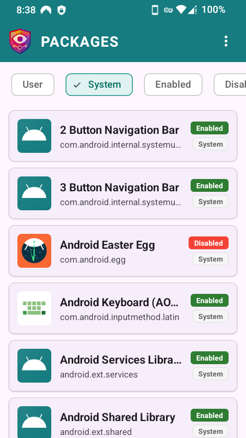
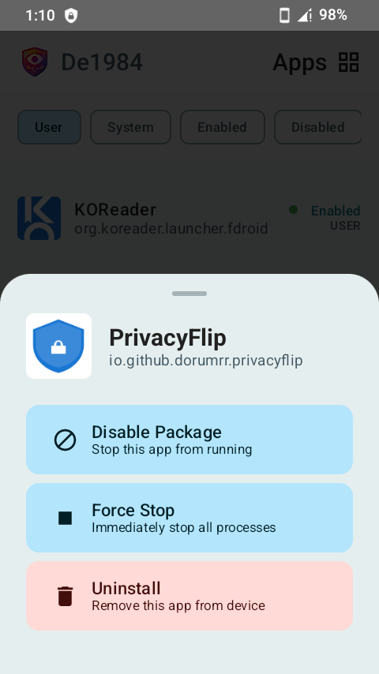
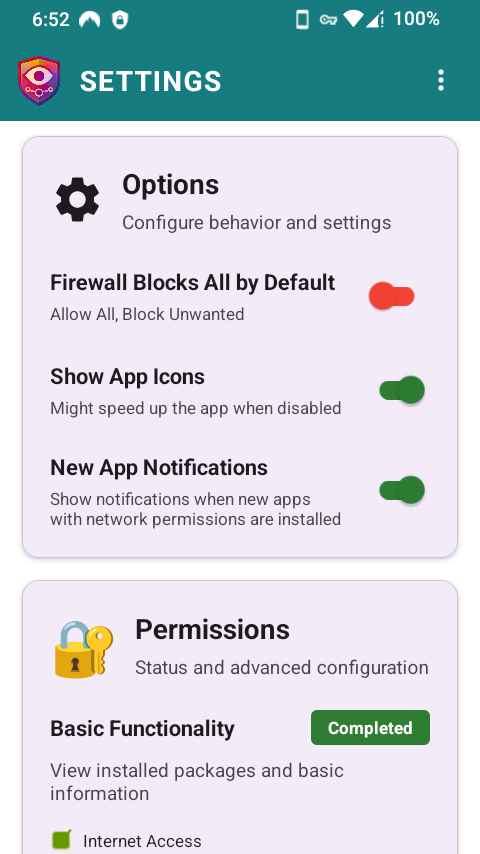

# De1984

**Privacy isn’t default. Take it back with De1984 Firewall and Package control.**

A privacy-focused Firewall and Package Manager for Android devices.

## 📸 Screenshots

  
  
  
  
  

## 💖 Support Development

> De1984 protects your privacy. You can protect its future: **[DONATE](https://buymeacoffee.com/ossdev)** ♥️

## ✨ Features

### 🛡️ Firewall
- **VPN-based firewall** (no root required)
- Block apps from accessing WiFi, Mobile Data, or Roaming
- Per-app network control with granular permissions

### 📦 Package Management (with root)
- Enable/disable users of system apps
- Force stop running apps
- Uninstall system and user apps

### 🔒 Privacy First
- Zero tracking or analytics
- No telemetry
- Local-only data storage
- 100% open source (MIT License)

## 📋 Requirements

- **Android 8.0 (API 26) or higher**
- Root access optional (required for package management features)
- VPN permission (for firewall functionality)

## 🔐 Permissions

- **INTERNET**: For firewall functionality (VPN-based)
- **ACCESS_NETWORK_STATE**: Monitor network connectivity
- **BIND_VPN_SERVICE**: Create local VPN for firewall
- **QUERY_ALL_PACKAGES**: View installed apps (optional)
- **Root access**: For advanced package management (optional)

## 🤝 Contributing

Help make this app better. No contribution is too small!

### How to Contribute

1. **Fork the repository**
2. **Create a feature branch** (`git checkout -b feature/amazing-feature`)
3. **Make your changes**
4. **Commit your changes** (`git commit -m 'Add some amazing feature'`)
5. **Push to the branch** (`git push origin feature/amazing-feature`)
6. **Open a Pull Request**

All contributions are **valued** and **appreciated**!

## 📄 License

This project is licensed under the MIT License - see the [LICENSE](LICENSE) file for details.

## 📞 Support

- **Issues**: [GitHub Issues](https://github.com/dorumrr/de1984/issues)
- **F-Droid**: [De1984 Firewall and Package Control](https://f-droid.org/en/packages/io.github.dorumrr.de1984/)

---

*Giving Privacy its due, by Doru Moraru*
