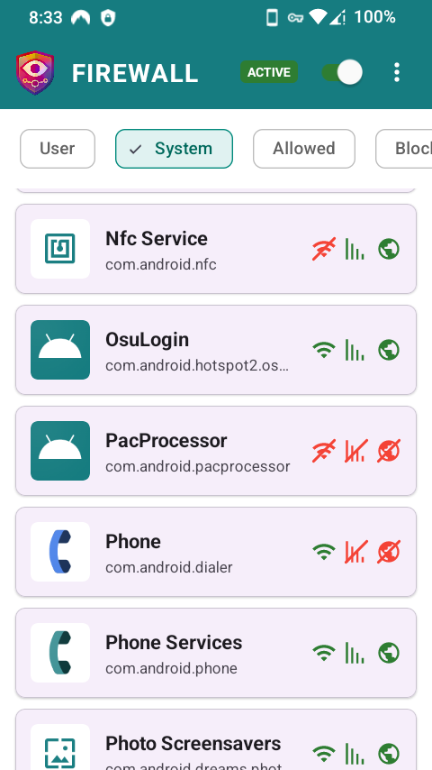
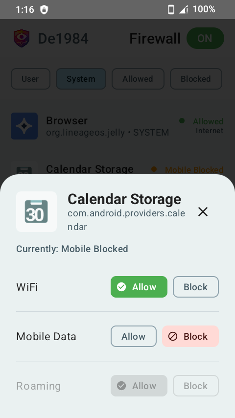
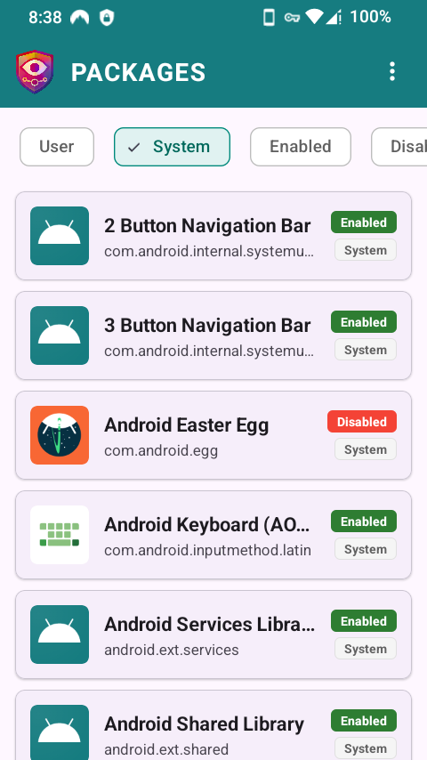
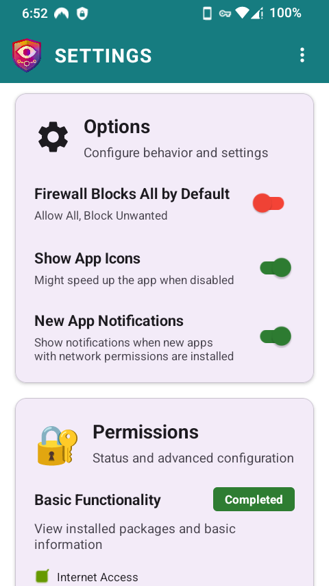

# De1984

**Privacy isn’t default. Take it back with De1984 Firewall and Package Control.**

    

> The name **De1984** is inspired by George Orwell’s novel Nineteen Eighty-Four, reflecting the app’s philosophy of resisting surveillance and reclaiming digital privacy. It symbolizes a reversal of the dystopian control described in the book, empowering users to take back control over their devices and data.

## 📸 Screenshots

  
  
  
  
  

## ✨ Features

### 🛡️ Firewall
- **Multiple firewall capabilities**: iptables, ConnectivityManager, NetworkPolicyManager, and VPN fallback
- **Automatic firewall method selection** based on device capabilities
- **Comprehensive iptables** for rooted devices provides kernel-level blocking with superior performance
- **ConnectivityManager** for Android 13+ devices with Shizuku, no root required
- **NetworkPolicyManager** for older devices with Shizuku, selectable manually
- **VPN backend** as fallback for maximum compatibility (no root required)
- Block apps from accessing WiFi, Mobile Data, or Roaming independently
- **Global firewall policies**: "Block All by Default" (allowlist) or "Allow All by Default" (blocklist)
- Screen-off blocking to save battery and data
- Real-time network state monitoring and automatic rule application

### 📦 Package Management (with Shizuku or root)
- Enable/disable system apps
- Force stop running apps
- Uninstall system and user apps
- Works with Shizuku (no root required) or traditional root access
- Filter packages by system/user apps, enabled/disabled state
- Search functionality for quick package lookup

### 🔒 Privacy First
- Zero tracking or analytics
- No telemetry
- Local-only data storage
- No proprietary libraries
- Buildable from source
- 100% open source (MIT License)

## 📋 Requirements

- **Android 8.0 (API 26) or higher**
- **For iptables firewall**: Root, or Shizuku running in root mode. Shizuku started over ADB runs as the shell user and cannot create kernel rules, so this backend stays unavailable in that mode
- **For ConnectivityManager firewall**: Shizuku + Android 13+ (no root required)
- **For NetworkPolicyManager firewall**: Shizuku (no root required). On ROMs that do not implement `POLICY_REJECT_ALL` it can only block metered background data, not WiFi
- **For VPN firewall**: VPN permission (no root required, works on all Android versions)
- **For package management**: Shizuku or root access

## 🔐 Permissions

- **ACCESS_NETWORK_STATE**: Monitor network connectivity for automatic rule application
- **BIND_VPN_SERVICE**: Create local VPN for VPN-based firewall backend
- **QUERY_ALL_PACKAGES**: View all installed apps
- **POST_NOTIFICATIONS**: Show notifications for new app installations (optional)
- **RECEIVE_BOOT_COMPLETED**: Auto-start firewall on device boot
- **Shizuku or root access**: For the iptables, ConnectivityManager and NetworkPolicyManager firewalls, and for package management (optional)

## ⚠️ Good to Know

**If you use VPN mode, turn OFF "Block connections without VPN"**

In Android's VPN settings, De1984 must not have "Block connections without VPN" (also called lockdown) enabled. De1984's VPN routes only the apps you have *blocked* through its tunnel — allowed apps deliberately bypass it and use the network directly. Apps that share a user ID share one verdict, so an allowed app that shares one with an app whose rule blocks goes through the tunnel too. Lockdown tells Android to drop anything that does not go through the VPN, so it blocks exactly those allowed apps. On recent Android versions this switch is turned on automatically when you grant a VPN, so it is worth checking.

**iptables needs real root, not ADB-mode Shizuku**

Shizuku started over ADB runs as the shell user (uid 2000), which cannot create kernel firewall rules. The iptables backend stays greyed out in that mode. It becomes available with root, or with Shizuku itself started in root mode.

**AUTO mode never picks NetworkPolicyManager**

Automatic selection tries iptables, then ConnectivityManager, then VPN. NetworkPolicyManager is available only by choosing it manually in Settings, and on ROMs that do not implement `POLICY_REJECT_ALL` it can block metered background data but not WiFi.

## 🤝 Contributing

Help make this app better. No contribution is too small!

### How to Contribute

1. **Fork the repository**
2. **Create a feature branch** (`git checkout -b feature/amazing-feature`)
3. **Make your changes**
4. **Commit your changes** (`git commit -m 'Add some amazing feature'`)
5. **Push to the branch** (`git push origin feature/amazing-feature`)
6. **Open a Pull Request**

All contributions are **valued** and **appreciated**!

## 📄 License

This project is licensed under the MIT License - see the [LICENSE](LICENSE) file for details.

## 💖 Support Development

De1984 protects your privacy. You can protect its future!

---

*Late nights for brighter days.*

Created by Doru Moraru
