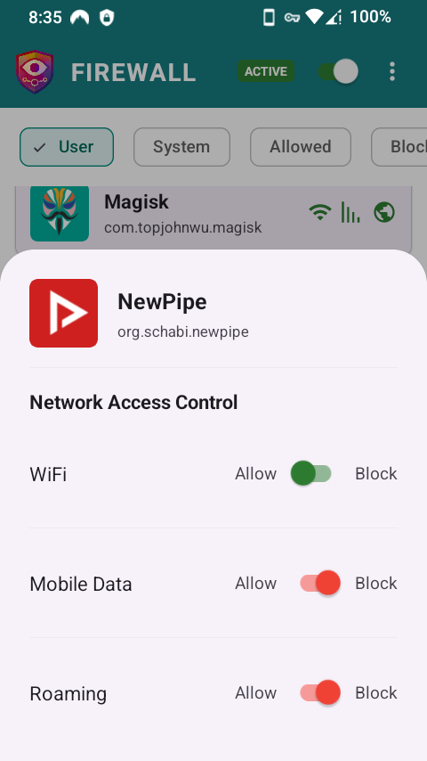
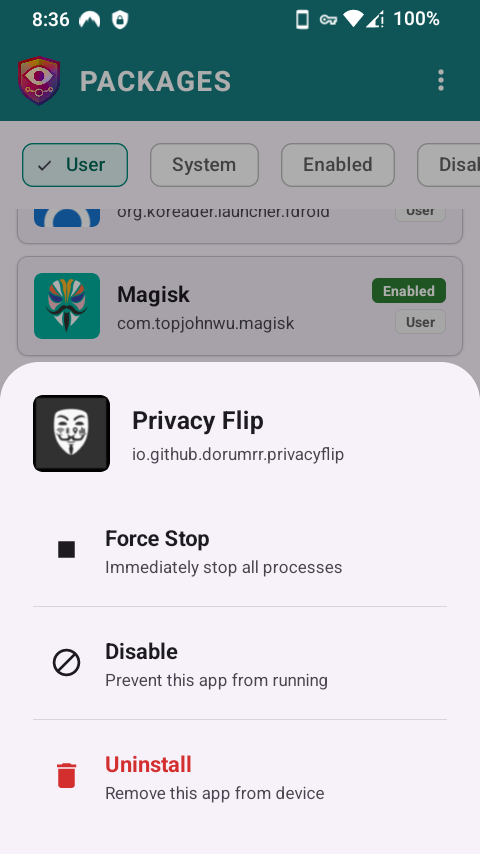

# De1984

**Privacy isn’t default. Take it back with De1984 Firewall and Package control.**

A privacy-focused Firewall and Package Manager for Android devices.

## 📸 Screenshots

<p align="center">
  
  
  
  
  
</p>

## ✨ Features

### 🛡️ Firewall
- **VPN-based firewall** (no root required)
- Block apps from accessing WiFi, Mobile Data, or Roaming
- Per-app network control with granular permissions

### 📦 Package Management (with root)
- Enable/disable users of system apps
- Force stop running apps
- Uninstall system and user apps

### 🔒 Privacy First
- Zero tracking or analytics
- No telemetry
- Local-only data storage
- 100% open source (MIT License)

### 🎨 Modern Design
- Material Design 3
- Dark mode support
- Clean, intuitive UI
- Fast and responsive

### 🔓 FLOSS Compliance
- No proprietary libraries
- No Google Play Services
- No Firebase or analytics
- Buildable from source

## 📋 Requirements

- **Android 8.0 (API 26) or higher**
- Root access optional (required for package management features)
- VPN permission (for firewall functionality)

## 🔐 Permissions

- **INTERNET**: For firewall functionality (VPN-based)
- **ACCESS_NETWORK_STATE**: Monitor network connectivity
- **BIND_VPN_SERVICE**: Create local VPN for firewall
- **QUERY_ALL_PACKAGES**: View installed apps (optional)
- **Root access**: For advanced package management (optional)

## 💖 Support Development

If you find De1984 useful, consider supporting development:

- **[DONATE](https://buymeacoffee.com/ossdev)** ♥️

*Your support helps maintain and improve De1984 app.*

## 📥 Installation

### F-Droid (Recommended)
- ✅ Automatic updates via [F-Droid app](https://f-droid.org/en/packages/io.github.dorumrr.de1984/)
- ✅ Signed by F-Droid
- ✅ Reproducible builds

### GitHub Releases (Latest)
- ✅ Get latest releases faster (before F-Droid)
- ✅ Signed by developer
- ⚠️ Manual installation required

**Note:** You cannot switch between F-Droid and GitHub versions (different signatures). Choose one and stick with it.

## 🤝 Contributing

Help make this app better. No contribution is too small!

### How to Contribute

1. **Fork the repository**
2. **Create a feature branch** (`git checkout -b feature/amazing-feature`)
3. **Make your changes**
4. **Commit your changes** (`git commit -m 'Add some amazing feature'`)
5. **Push to the branch** (`git push origin feature/amazing-feature`)
6. **Open a Pull Request**

### What You Can Contribute

- 🐛 **Bug fixes** - Found a bug? Fix it!
- ✨ **New features** - Have an idea? Implement it!
- 📝 **Documentation** - Improve README, add comments
- 🎨 **UI improvements** - Better design, better UX
-  💡 **Ideas** - Open an issue to discuss

All contributions are **valued** and **appreciated**!

## 🚀 Quick Start

### Development Setup

1. **Clone the repository**
   ```bash
   git clone https://github.com/dorumrr/de1984.git
   cd de1984
   ```

2. **Run the development script**
   ```bash
   # Show welcome screen with command explanations
   ./dev.sh
   ```

3. **Install on device/emulator**
   ```bash
   # Install on physical device
   ./dev.sh install device

   # Install on emulator
   ./dev.sh install emulator

   # Auto-detect device/emulator
   ./dev.sh install
   ```

### Development Workflow

The `./dev.sh` script provides everything you need for development and releases:

#### 🔧 Development Commands

```bash
# Build debug APK for local testing
./dev.sh build

# Build, uninstall old, install fresh debug APK
./dev.sh install [device|emulator]

# Launch the app
./dev.sh launch

# Take screenshot (saved to screenshots/)
./dev.sh screenshot

# Show live app logs
./dev.sh logs

# Show device and app info
./dev.sh info

# Show all commands
./dev.sh help
```

#### 📦 Release Commands

**For F-Droid Distribution (Recommended):**

Phase 1: Testing
```bash
# Build with debug keystore for testing
./dev.sh fdroid

# Upload to GitHub and submit to F-Droid
# Wait for "reproducible is OK" confirmation
```

Phase 2: Production (After F-Droid confirms)
```bash
# First time only: Create production keystore
./dev.sh create-keystore

# Build and sign with production key
./dev.sh release

# Follow on-screen instructions to:
# - Rename and upload APK to GitHub
# - Update F-Droid YAML with production SHA256
# - Commit and push changes
# - Retrigger F-Droid CI
```

**For Personal Distribution:**
```bash
# Build and sign with production key
./dev.sh release

# Output: app/build/outputs/apk/release/de1984-v1.0.0-release-signed.apk
# Distribute this APK directly to users
```

### Understanding APK Types

| Command | Output File | Signature | Purpose |
|---------|-------------|-----------|---------|
| `./dev.sh build` | `de1984-v1.0.0-debug.apk` | Debug key | Local testing only |
| `./dev.sh fdroid` | `de1984-v1.0.0-release.apk` | Debug key | F-Droid testing phase |
| `./dev.sh release` | `de1984-v1.0.0-release-signed.apk` | Production key | F-Droid production + Personal |

### Release Build Workflow

See [RELEASE_SIGNING_GUIDE.md](RELEASE_SIGNING_GUIDE.md) for complete release instructions including:
- F-Droid release workflow
- Production release workflow
- Keystore management and backup
- Signature verification
- Troubleshooting

## 🏗️ Technical Details

### Architecture
- **Language**: Kotlin 100%
- **UI Framework**: XML Views + ViewBinding + Material 3
- **Architecture**: MVVM + Repository pattern
- **Database**: Room for local storage
- **DI**: Manual Dependency Injection (ServiceLocator pattern)
- **Root Operations**: LibSU
- **Async**: Kotlin Coroutines + StateFlow

### Code Quality
- **DRY, KISS, Clean Code** principles
- **MVVM + Repository** architecture
- **Manual Dependency Injection**
- **Material Design 3** compliance
- **Android 8.0 - 15** compatibility (API 26-35)

## 📄 License

This project is licensed under the MIT License - see the [LICENSE](LICENSE) file for details.

## 📞 Support

- **Issues**: [GitHub Issues](https://github.com/dorumrr/de1984/issues)
- **F-Droid**: [De1984 Firewall and Package Control](https://f-droid.org/en/packages/io.github.dorumrr.de1984/)

---

*Giving Privacy its due, by Doru Moraru*
